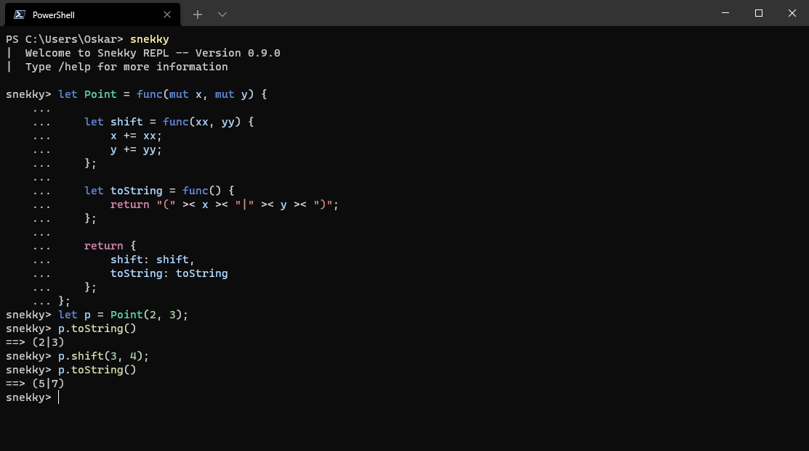

<div align="center">
<p>
    
</p>
<h1>The Snekky Programming Language</h1>

[snekky-lang.org](https://snekky-lang.org) |
[Releases](https://github.com/snekkylang/snekky/releases) |
[Previews](https://github.com/snekkylang/snekky/actions) |
[Examples](https://github.com/snekkylang/snekky/tree/master/examples) |
[Report an issue](https://github.com/snekkylang/snekky/issues)

</div>

### Disclaimer!
Please do not take this project too seriously. I'm in no way a professional. To be honest, I'm surprised myself that Snekky is even somewhat usable.

## About
Snekky is a simple object-based, imperative programming language compiling to a custom bytecode. Checkout the [specification](spec) for more information.
## Features
- Built-in REPL.
- Familiar syntax.
- Compiles to a custom bytecode.
- Supports multithreading.
- Arrays and hashes.
- Lambdas and closures are supported.
- Almost everything is an expression (including `if`s, `when`s and blocks).
- Final (`let`) and mutable (`mut`) variables.
- Destructuring of arrays and hashes.
- `for ... in` loops with iterators.
- As flexible and dynamic as a snek.

## Installation

### Compile it yourself
1. Download and install [Haxe](https://haxe.org/).
2. Clone this repository.
3. Compile the project by executing `haxe scripts/build-cpp.hxml`.
4. Binaries will be located in `cpp/`.

### Download release binaries
Builds can be found in the [releases tab](https://github.com/snekkylang/snekky/releases) or the [actions tab](https://github.com/snekkylang/snekky/actions) (login required).

## Usage

1. Create a file called `input.snek` in a text editor (e.g. [Visual Studio Code](https://code.visualstudio.com/)).
2. **(optional)** Install the Snekky [VSCode extension](https://github.com/snekkylang/snekky-vscode) for syntax highlighting.
2. Enter some code (check out the examples).
3. Run it using `snekky input.snek`.

## Example
For more examples, checkout the [examples folder](https://github.com/snekkylang/snekky/tree/master/examples).
```js
// An implementation of the classic FizzBuzz programming test
for let i in 0..100 {
    Sys.println(when {
        i % 3 == 0 && i % 5 == 0 => "FizzBuzz"
        i % 3 == 0 => "Fizz"
        i % 5 == 0 => "Buzz"
        else => i
    });
}
```

## REPL

The REPL allows you to quickly test a few lines of code by entering them one after the other. Syntax highlighting and automatic block indentation are supported.


## Additional tools

- [snekkyd](https://github.com/snekkylang/snekkyd) - Decompiler for Snekky bytecode files.
- [snekkyd-gui](https://github.com/snekkylang/snekkyd-gui) - GUI frontend for snekkyd.
- [snekkyp](https://github.com/snekkylang/snekkyp) - Disassembler for Snekky bytecode files.
- [Snekky VSCode](https://github.com/snekkylang/snekky-vscode) - Extension for VSCode providing syntax highlighting.

## Contributing

1. Fork it (<https://github.com/snekkylang/snekky/fork>)
2. Create your feature branch (`git checkout -b my-new-feature`)
3. Commit your changes (`git commit -am 'Add some feature'`)
4. Push to the branch (`git push origin my-new-feature`)
5. Create a new Pull Request

## Contributors

- [Senk Ju](https://github.com/SenkJu) - creator and maintainer
